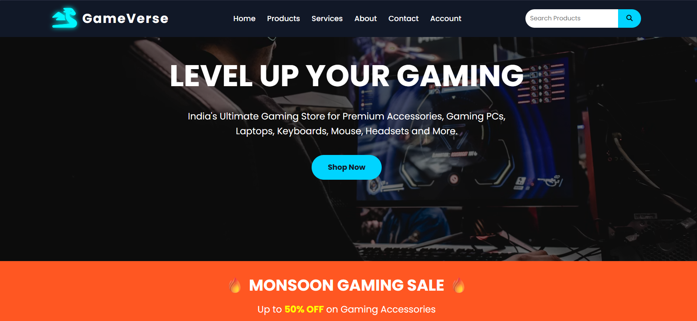
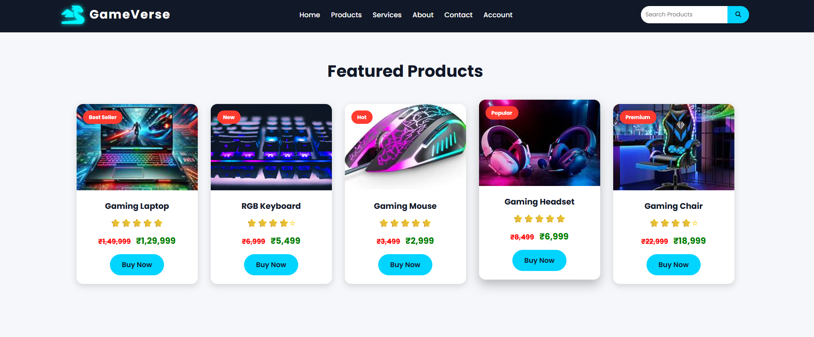
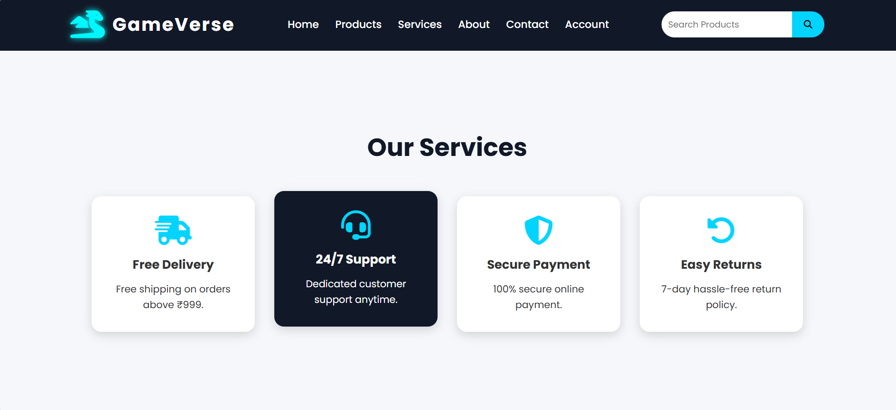
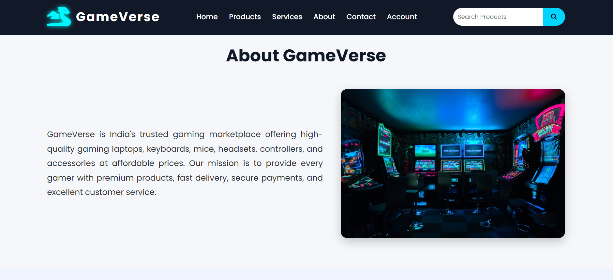
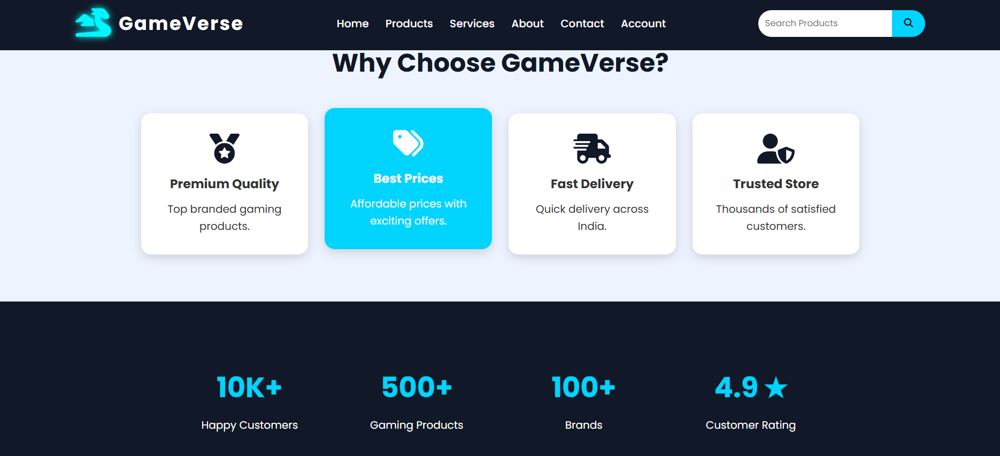
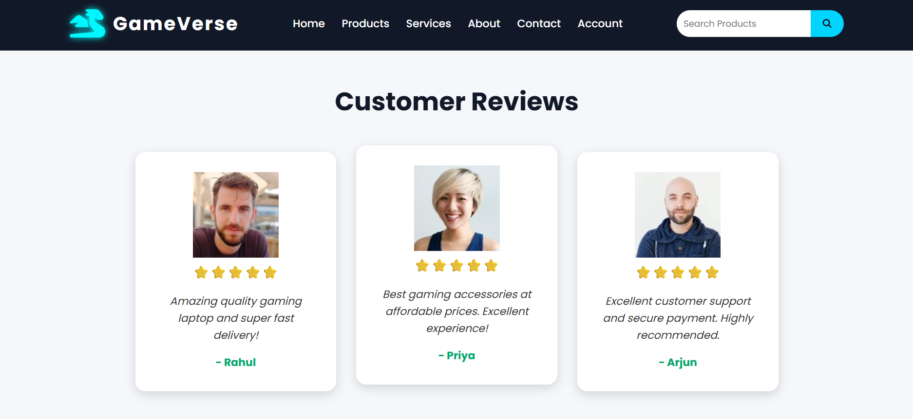
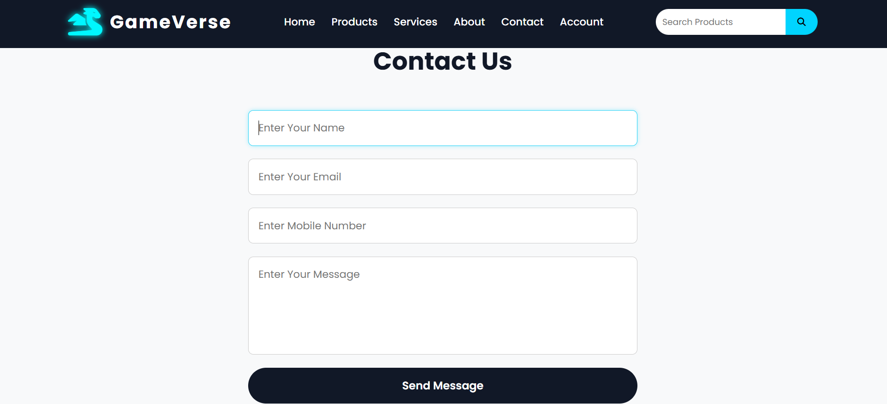
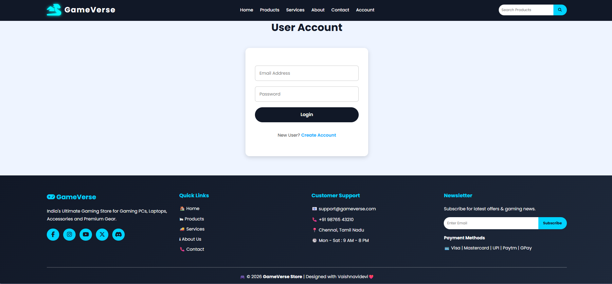

# Ex02 Commercial Website
## Date:02/08/26
## Aim

To create a commercial website using CSS Flexbox.


## Algorithm

### Step 1
Create an HTML file (index.html).

### Step 2
Create a CSS file (style.css).

### Step 3
Include a navigation bar with links to different sections.

### Step 4
Include social media links in the footer with copyright information.

### Step 5
Define global styles for fonts, colors, and layout.

### Step 6
Style the header, navigation bar, and website sections.

### Step 7
Use CSS Flexbox for responsive layout design.

### Step 8
Add hover effects and transitions for better user interaction.

### Step 9
Include images and multimedia elements.

### Step 10
Optimize images for faster loading and a professional appearance.

### Step 11
Open the HTML file in a web browser to verify the layout.

### Step 12
Fix styling issues and improve content placement.

### Step 13
Deploy the website.

### Step 14
Host the project using GitHub Pages.

## Program

## index.html
```
<!DOCTYPE html>
<html lang="en">

<head>

<meta charset="UTF-8">

<meta name="viewport" content="width=device-width, initial-scale=1.0">

<title>GameVerse Store</title>

<link rel="stylesheet" href="style.css">

<link rel="preconnect" href="https://fonts.googleapis.com">

<link rel="preconnect" href="https://fonts.gstatic.com" crossorigin>

<link href="https://fonts.googleapis.com/css2?family=Poppins:wght@300;400;500;600;700&display=swap" rel="stylesheet">

<link rel="stylesheet"
href="https://cdnjs.cloudflare.com/ajax/libs/font-awesome/6.5.2/css/all.min.css">

</head>

<body>

<!-- ================= HEADER ================= -->

<header>

<div class="logo">

<i class="fa-solid fa-dragon"></i>

<div>

<h2>GameVerse</h2>

</div>

</div>          

<nav>

<ul>

<li><a href="#home">Home</a></li>

<li><a href="#products">Products</a></li>

<li><a href="#services">Services</a></li>

<li><a href="#about">About</a></li>

<li><a href="#contact">Contact</a></li>

<li><a href="#account">Account</a></li>

</ul>

</nav>

<div class="search-box">

<input type="text" placeholder="Search Products">

<button>

<i class="fa-solid fa-magnifying-glass"></i>

</button>

</div>

</header>

<!-- ================= HERO SECTION ================= -->

<section class="hero" id="home">

<div class="hero-content">

<h1>

LEVEL UP YOUR GAMING

</h1>

<p>

India's Ultimate Gaming Store for Premium Accessories,
Gaming PCs, Laptops, Keyboards, Mouse, Headsets and More.

</p>

<a href="#products" class="btn">

Shop Now

</a>

</div>

</section>
```
## style.css
```
*{
    margin:0;
    padding:0;
    box-sizing:border-box;
    font-family:'Poppins',sans-serif;
}

html{
    scroll-behavior:smooth;
}

body{
    background:#f5f7fa;
    color:#333;
    line-height:1.6;
}

/* ---------- Header ---------- */

header{
    display:flex;
    justify-content:space-between;
    align-items:center;
    padding:18px 8%;
    background:#111827;
    position:sticky;
    top:0;
    z-index:1000;
}

.logo{
    display:flex;
    align-items:center;
    gap:12px;
}

.logo i{
    font-size:42px;
    color:#00f7ff;
    text-shadow:0 0 10px cyan;
}

.logo h2{
    color:white;
    font-size:28px;
    letter-spacing:2px;
}

.logo span{
    color:#00f7ff;
    font-size:12px;
    letter-spacing:3px;
}

/* ---------- Navigation ---------- */

nav ul{
    display:flex;
    list-style:none;
    gap:25px;
}

nav ul li a{
    text-decoration:none;
    color:white;
    font-weight:500;
    transition:.3s;
}

nav ul li a:hover{
    color:#00d4ff;
}

/* ---------- Search Box ---------- */

.search-box{
    display:flex;
}

.search-box input{
    padding:10px;
    border:none;
    outline:none;
    width:200px;
    border-radius:25px 0 0 25px;
}

.search-box button{
    border:none;
    background:#00d4ff;
    padding:10px 18px;
    cursor:pointer;
    border-radius:0 25px 25px 0;
    transition:.3s;
}

.search-box button:hover{
    background:white;
}

/* ---------- Hero Section ---------- */

.hero{
    height:90vh;

    background:
    linear-gradient(rgba(0,0,0,.55),rgba(0,0,0,.55)),
    url("https://images.unsplash.com/photo-1542751371-adc38448a05e?auto=format&fit=crop&w=1600&q=80");

    background-size:cover;
    background-position:center;

    display:flex;
    justify-content:center;
    align-items:center;
    text-align:center;
}

.hero-content{
    color:white;
}

.hero-content h1{
    font-size:65px;
    margin-bottom:20px;
}

.hero-content p{
    font-size:20px;
    max-width:750px;
    margin:auto;
    margin-bottom:35px;
}

.btn{
    display:inline-block;
    text-decoration:none;
    background:#00d4ff;
    color:#111827;
    padding:14px 35px;
    border-radius:30px;
    font-weight:bold;
    transition:.3s;
}

.btn:hover{
    background:white;
    transform:translateY(-5px);
}
```


## Output

















## Result

The program for creating a Commercial Website using CSS Flexbox was implemented successfully, and the website was deployed using GitHub Pages.


